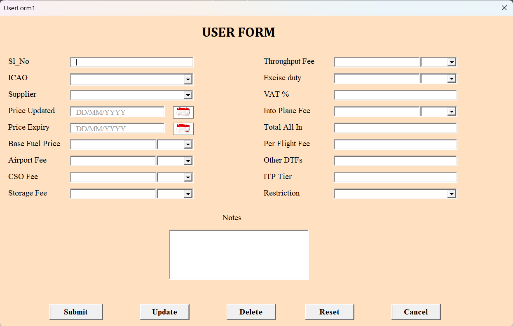

# 👋 Hi, I'm Amaya.A
**_Data Analyst_** | **_Data Driven Decision Making_** | **_Transforming Insights into Impact_**

[Linkedin](www.linkedin.com/in/ameyarinesh)

<!--Section 1: Introduction-->

## 🌟 About Me  
I'm a Data Analyst Intern at Rows & Columns, passionate about transforming raw data into actionable insights.  
Skilled in **Power BI**, **Excel**, **DAX**, and **SQL**, I build dynamic dashboards, streamline reporting workflows, and support data-driven decision-making.  
Successfully handled datasets of up to 2,000+ records and built dashboards that improved decision-making for stakeholders.
🚀 Let’s turn data into impactful stories!  

---

## 🎓 Education  
- **BCA-MOBILE APPLICATIONS & CLOUD TECHNOLOGY**  
  *SACRED HEART COLLEGE, THEVARA (2022 – 2025)*  

---

## 💼 Work Experience  

### 🔹 Data Analyst Intern — *Rows & Columns, Kozhikode*  
- Handled data cleaning, transformation, and visualisation tasks.  
- Prepared weekly insights and reports for internal stakeholders.
- Improved proficiency in **Excel** and **Power BI** by creating 3+ dashboards, performing data cleaning, and analysing trends to support internal reporting.
  

### 🔹 Python Intern — *Info Park, Kochi*  
- Made a Python chatbot as part of the internship project.
- Enhanced knowledge in core Python and built a functional chatbot in 4 weeks.   
- Strengthened my understanding of Python fundamentals through hands-on coding and debugging.

---

## 📊 Projects  

### Fuel Pricing Database Management System – [Excel VBA]  
🌍 Formulated an Excel VBA UserForm–based fuel pricing database with insert, edit, update and delete functionality.  
🔍 Implemented automated multi-currency and unit conversion to standardise 5+ currencies into USD per gallon.  
📈 Engineered automated calculations for total fuel cost, including VAT, fees, and taxes, reducing manual computation errors by 80%.  

  
[🔗 View Dashboard](https://app.powerbi.com/view?r=eyJrIjoiYWExYzc0MTAtODU3NS00OTZhLWEwZjEtYzBjNTRjNjViODUwIiwidCI6ImM2ZTU0OWIzLTVmNDUtNDAzMi1hYWU5LWQ0MjQ0ZGM1YjJjNCJ9)  

---

### CRM Sales Performance Analysis Power BI – [Power BI and Excel]  
🏨 Designed an interactive dashboard to analyse 2,000+ CRM records, reducing manual reporting time by 40%. 
💡 Evaluated sales performance across 8+ industries and assessed monthly pipeline health. 
📊 Identified top-performing sales agents and tracked conversion rates across 5+ countries, improving visibility into regional performance.
🧹 Used Power Query to clean and transform data, and created 5+ DAX measures for accurate and scalable calculations.

  
[🔗 View Dashboard](https://app.powerbi.com/view?r=eyJrIjoiODE4NDQyNTMtOTJmZC00MjRiLWI4MWUtNTFlZGRhZDIwYjQ3IiwidCI6ImM2ZTU0OWIzLTVmNDUtNDAzMi1hYWU5LWQ0MjQ0ZGM1YjJjNCJ9&pageName=931b63cfc48963c6886a)  

---
### WISP - [Python Django,html]                                                                                                
• 🚀 Developed WISP, a web-based interactive study platform using Python and Angular, supporting Admin, Teacher, and Student roles with 100+ users.
• 🔐 Implemented role-based access control, reducing manual academic coordination by 40%.
• 📚 Built features like study material uploads, assignment submissions with deadlines, and leave management, improving task completion by 30%.
• 🤖 Integrated an AI-powered chatbot to resolve 70%+ of student queries instantly, enhancing overall learning support.

## 📜 Courses & Certifications  
- ✅ Codebasics Certified: Advanced Excel, Power BI Developer, SQL Developer  
- 🎯 SPES-Rashtriya Raksha University: Certificate in Sports Analytics  
- ⚽ Mad About Sports: Advanced Football Analytics Master Class  

---

## 🧠 Tools & Skills  
 
 
 
 
  

---

## 🎯 Interests  
- 📊 Dashboard Design   
- 🎬 Movies & 🎒 Traveling  

---

## 📫 Contact Details  
*Let’s connect and see how we can make a difference together!*  

<table>
  <tbody>
    <tr>
      <td>📧</td>
      <td><a href="mailto:ameyarinesh@gmail.com">ameyarinesh@gmail.com</a></td>
    </tr>
    <tr>
      <td>📞</td>
      <td>(+91) 9745156233 </td>
    </tr>
    <tr>
      <td>📍</td>
      <td>Kozhikode, Kerala</td>
    </tr>
    <tr>
      <td>⬇️</td>
      <td><a href="Boniface_Data_Analyst.pdf">Download my CV</a></td>
    </tr>
    <tr>
      <td>🌐</td>
      <td><a href="https://www.linkedin.com/in/ameyarinesh">Let’s connect on LinkedIn</a></td>
    </tr>
  </tbody>
</table>
